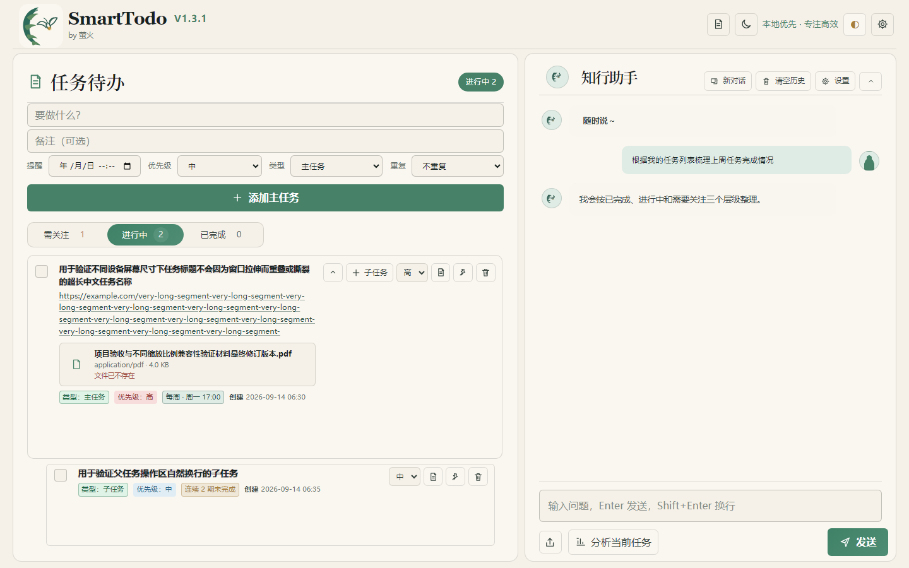
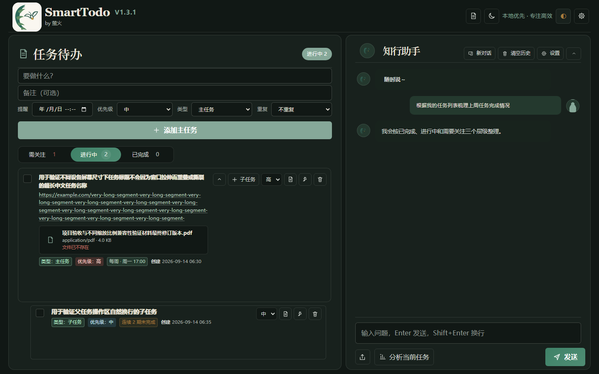
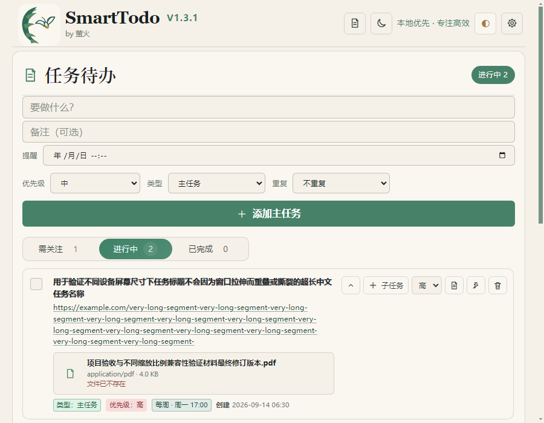
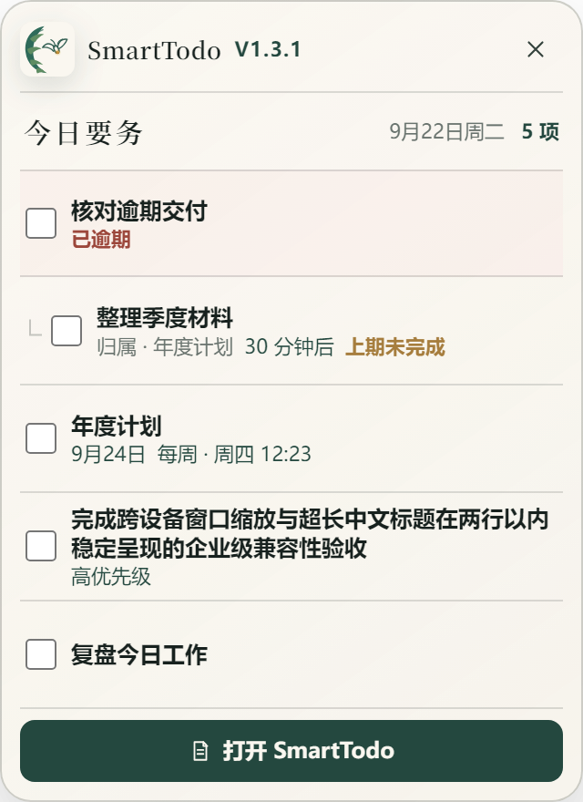

<p align="center">
  
</p>

<h1 align="center">SmartTodo</h1>

<p align="center"><b>本地优先、简洁克制的 Windows 桌面任务管理器</b></p>

<p align="center">
  
  
  
  
  
</p>

<p align="center">
  <a href="https://github.com/whight-autumn/SmartTodo/releases/latest"><b>下载 Windows 便携版</b></a>
  ·
  <a href="release/版本迭代说明.md">查看版本迭代</a>
</p>



SmartTodo 把主任务、子任务、提醒、附件和可选 AI 助手放在同一个本地工作台中。任务、会话、设置与 API Key 均保存在本机；不配置 AI、甚至断网时，任务管理仍可完整使用。

## 三分钟上手

### 1. 下载并启动

1. 前往 [GitHub Releases](https://github.com/whight-autumn/SmartTodo/releases/latest) 下载 `SmartTodo-1.3.1.exe`。
2. 如果旧版本仍在运行，请先从系统托盘完全退出。
3. 双击便携程序即可使用，无需安装。未签名构建首次运行时可能出现 Windows SmartScreen 提示，请确认下载来源后继续。

从旧版本升级时，V1.3.1 会自动尝试迁移历史运行数据；新目录已有数据时不会覆盖。

### 2. 创建一次性任务

在“任务待办”顶部输入任务名称，可按需填写备注、提醒时间和优先级。“重复”保持“不重复”，然后点击“添加主任务”。

- 需要拆分步骤时，点击任务右侧的“子任务”。
- 点击图钉可置顶重要事项；优先级和置顶互不冲突。
- 使用“需关注／进行中／已完成”快速切换当前视图。
- 点击任务右侧的备注按钮，可继续编辑备注、链接和附件。

### 3. 创建重复任务

在原有任务添加区把“重复”改为每天、每周、每月或每年。重复任务必须设置首次提醒时间，SmartTodo 会从中保留后续周期所需的日期与时分。

| 重复方式 | 新周期开始时间 | 后续提醒依据 |
| --- | --- | --- |
| 每天 | 每天 04:00 | 首次提醒的时、分 |
| 每周 | 每周一 04:00 | 首次提醒所在星期与时、分 |
| 每月 | 每月 1 日 04:00 | 首次提醒的日期与时、分 |
| 每年 | 每年 1 月 1 日 04:00 | 首次提醒的月、日、时、分 |

若上一周期仍未完成，SmartTodo 会在新周期任务下增加“上期未完成”子任务；离线错过多个周期时会合并提示，避免列表无限增长。月末日期和闰日会自动采用有效日期，并在条件恢复时回到原始锚点。

### 4. 使用桌面任务笺

点击主界面右上角的任务笺按钮，可显示或收起桌面右侧的小窗。任务笺最多展示 5 项未完成任务，优先顺序为：

```text
已逾期 → 24 小时内到期 → 置顶 → 高优先级 → 其余任务
```

任务笺支持直接完成任务和打开主界面；它不置顶、不抢占键盘焦点，也不能创建、编辑或删除任务。位置与可见性会被记住，主题和亮度会与主界面同步。

### 5. 使用知行助手（可选）

打开“知行助手”的设置，选择 DeepSeek、OpenAI 或自定义 OpenAI-compatible 服务，再填写 API 地址、模型和 API Key。可以直接对话，也可以让助手分析当前任务。API Key 仅保存在本机运行数据中，不写入仓库或日志。

## 界面导览

### 深浅双主题

暖纸、竹青、漆夜与朱砂构成现代新中式视觉体系。主题、亮度和减少动态效果设置不会改变任务数据。

<table>
  <tr>
    <td width="50%"></td>
    <td width="50%"></td>
  </tr>
  <tr>
    <td align="center">文房案台 · 亮色</td>
    <td align="center">漆夜流萤 · 暗色</td>
  </tr>
</table>

### 响应式工作台

主界面覆盖 1366×768 至 2560×1440、窄窗口以及 Windows 125%／150% 缩放。长标题、长链接、长文件名和任务操作区会自然换行，不因窗口拉伸而交叉或撕裂。

<p align="center">
  
</p>

### 半透明桌面任务笺

任务笺以轻量、半透明的方式停靠在桌面右侧，让近期任务随时可见，同时避免覆盖日常工作窗口。

<p align="center">
  
</p>

## 核心能力

- 主任务／子任务、一次性或每天／每周／每月／每年重复、提醒、高中低优先级、置顶、折叠、完成与撤销。
- 重复任务采用本地 04:00 周期刷新、提醒锚点投影、未完成承接与多期离线合并。
- 可重复编辑备注；安全打开 HTTP/HTTPS 链接；每项任务最多 10 个附件，单个不超过 20MB。
- “需关注／进行中／已完成”筛选；完成任务保留 15 天后自动清理。
- DeepSeek、OpenAI 与自定义 OpenAI-compatible 服务；支持流式对话、会话管理和任务分析。
- 深浅主题、75%–125% 亮度、系统通知、托盘常驻、单实例运行和减少动态效果模式。
- 桌面任务笺支持五任务排序、完成同步、位置记忆、显示器变化回收和持久化失败回滚。

## 版本迭代

| 版本 | 日期 | 迭代重点 |
| --- | --- | --- |
| V1.0.7 | 2026-09-15 | 修复附件状态显示，完善完成、删除与孤立附件清理。 |
| V1.2.0 | 2026-09-21 | 完成现代新中式界面重构，引入响应式工作台与桌面任务笺。 |
| V1.2.1 | 2026-09-21 | 修复任务操作区、知行助手、顶部工具区和任务笺交互错位。 |
| V1.2.2 | 2026-09-22 | 修复时间输入黑屏与亮度悬停断层，增强操作反馈和可访问性。 |
| V1.3.0 | 2026-09-22 | 新增周期任务、04:00 刷新、提醒锚点和未完成任务承接。 |
| V1.3.1 | 2026-09-22 | 统一 SmartTodo 品牌、Windows 包名与运行数据目录，兼容迁移历史数据。 |

完整演进背景、兼容策略和各版本详细改动见 [`release/版本迭代说明.md`](release/版本迭代说明.md)；面向开发者的变更记录见 [`CHANGELOG.md`](CHANGELOG.md)。

## 数据与升级兼容

当前运行数据目录：

```text
%APPDATA%\SmartTodo\运行数据
```

任务附件目录：

```text
%APPDATA%\SmartTodo\运行数据\task-attachments\<任务ID>\
```

V1.3.1 兼容 V1.0.7 至 V1.3.0 的任务、草稿、主题、AI 配置、会话和受管附件。首次启动会优先从 `%APPDATA%\智能任务管家\运行数据` 迁移，若不存在则兼容更早的 `%APPDATA%\smart-assistant`；SmartTodo 新目录已有数据时不会覆盖。升级前建议备份整个“运行数据”目录，请勿分发其中的 API Key。

提醒和周期刷新由本地应用进程执行。SmartTodo 完全退出后不会在后台发送通知；重新启动时会补做周期刷新，并为当前未提醒的到期周期补发一次提醒。

## 从源码运行

需要 Node.js 18 或更高版本。

```powershell
npm install
npm start
```

### 测试

```powershell
# 纯逻辑、IPC、安全边界与静态契约
npm test

# 主界面行为、响应式矩阵、真实双窗口任务笺
npm run test:ui
```

V1.3.1 当前共有 153 项单元测试：151 项通过，2 项因当前 Windows 环境不支持创建符号链接而明确跳过，0 项失败。真实 Electron UI 流水线覆盖主窗口、周期刷新与提醒去重、8 组尺寸／缩放组合，以及任务笺在 100%／125%／150% 缩放下的关键行为。

### 构建

```powershell
npm run dist
```

该命令生成 `dist/SmartTodo-1.3.1.exe`。发布副本位于 `release/V1.3.1/`；EXE 由 `.gitignore` 排除，应通过 GitHub Releases 分发。

### 项目结构

```text
SmartTodo/
├── main.js                         # 主窗口、任务笺、托盘、通知与生命周期
├── preload.js / widget-preload.js  # 两个最小化隔离桥接
├── widget-controller.js            # 任务笺窗口、位置与可见性
├── task-attachment-store.js        # 受管附件事务
├── renderer/
│   ├── index.html / app.js         # 主界面与业务逻辑
│   ├── widget.html / widget.js     # 桌面任务笺
│   ├── recurrence-model.js         # 04:00 周期、日历投影与提醒指纹
│   ├── task-model.js               # 任务规范化、周期刷新与筛选
│   └── styles/                     # 令牌、布局、组件与动效
├── tests/                          # 单元与真实 Electron 窗口测试
├── docs/                           # 文件索引与 README 界面截图
├── assets/                         # 品牌源文件、字体与应用图标
└── release/                        # 版本迭代说明与各版本发布记录
```

逐文件职责见 [`docs/文件说明.md`](docs/文件说明.md)。

## 安全边界

- 主窗口与任务笺均启用 `contextIsolation: true`、关闭 `nodeIntegration`。
- preload 不暴露 `ipcRenderer`、文件系统、任意通道或任意绝对路径导入能力。
- 任务笺只接收允许展示的任务字段，只能请求完成、隐藏自身或打开主界面。
- 附件使用固定 IPC、随机磁盘名、规范路径校验和单调准备／持久化／提交事务。
- 备注先按纯文本转义，仅允许用户主动通过系统浏览器打开 HTTP/HTTPS 链接。

## License

[MIT](LICENSE) · by 萤火
